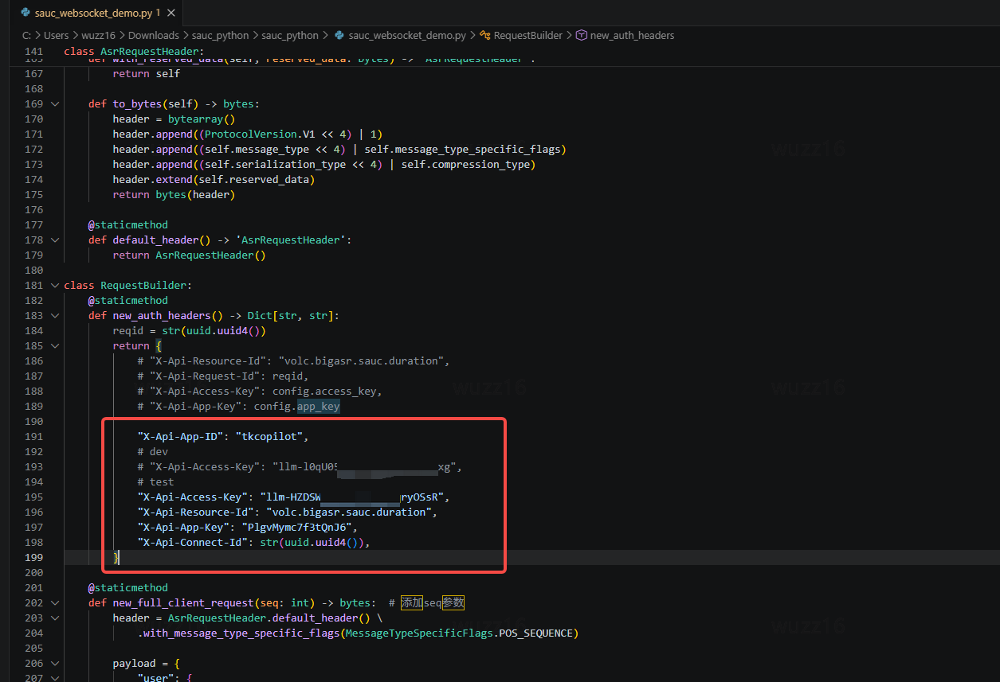

1. # TTS

1. ## 双向流

Set PYTHONPATH=. 

python examples/volcengine/bidirection.py --appid tkcopilot --access_token="llm-xxx" --voice_type zh_female_cancan_mars_bigtts --text "你好，我是火山引擎的语音合成服务。这是一个美好的旅程。" --endpoint ws://tkcopilot.tkitg.com/api/v3/tts/bidirection

1. ## 单向流

Set PYTHONPATH=. 

python examples/volcengine/unidirectional_stream.py --appid  tkcopilot --access_token  "llm-xxx"  --voice_type zh_female_cancan_mars_bigtts  --text "你好，我是火山引擎的语音合成服务。这是一个美好的旅程。"  --endpoint ws://tkcopilot.tkitg.com/api/v3/tts/unidirectional/stream

1. # ASR

1. ## 流式识别

1. ### 官方文档参考

[大模型流式语音识别API官方文档](https://www.volcengine.com/docs/6561/1354869?lang=zh)

- 官方demo

暂时无法在飞书文档外展示此内容

- 替换tkcopilot密钥



暂时无法在飞书文档外展示此内容

1. ### 接口执行命令

1. #### bigmodel

```Plain
python sauc_websocket_demo.py --file whoareyou.wav --url ws://tkcopilot.tkitg.com/api/v3/sauc/bigmodel
```

1. #### bigmodel_async

```Plain
python sauc_websocket_demo.py --file whoareyou.wav --url ws://tkcopilot.tkitg.com/api/v3/sauc/bigmodel_async
```

1. #### bigmodel_nostream

```Plain
python sauc_websocket_demo.py --file whoareyou.wav --url ws://tkcopilot.tkitg.com/api/v3/sauc/bigmodel_nostream
```

1. ## 录音

暂时无法在飞书文档外展示此内容

1. ### flash版本

```Python
def recognize_task(file_url=None, file_path=None):
    recognize_url = "http://tkcopilot.tkitg.com/api/v3/auc/bigmodel/recognize/flash"
    # 填入控制台获取的app id和access token
    # 注意事项: 新版控制台只需要 app_key 即可,不需要 access_key;老版本控制台都需要
    appid = "tkcopilot"
    token = "xxx"# copilot密钥

    headers = {
        "X-Api-App-Key": appid,
        "X-Api-Access-Key": token,
        "X-Api-Resource-Id": "volc.bigasr.auc_turbo", 
        "X-Api-Request-Id": str(uuid.uuid4()),
        "X-Api-Sequence": "-1", 
    }
```

1. ### 标准版

```Plain
submit_url = "http://tkcopilot.tkitg.com/api/v3/auc/bigmodel/submit"
query_url = "http://tkcopilot.tkitg.com/api/v3/auc/bigmodel/query"
appid = "tkcopilot"
token = "xxx"# copilot密钥
```